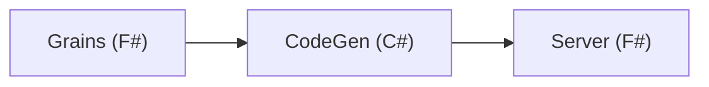

# Microsoft Orleans with F#

This repository holds the F# code that implements the Microsoft Orleans quickstart example UrlShortener:

- [Quickstart: Build your first Orleans app with ASP.NET Core](https://learn.microsoft.com/en-us/dotnet/orleans/quickstarts/build-your-first-orleans-app?tabs=visual-studio-code)

## Project structure



Notice that for now, it's necessary to have part of the project in C#, so Orleans correctly generates code. There's more information at the following links:

- [DejanMilicic/OrleansFsharp](https://github.com/DejanMilicic/OrleansFsharp)
- Issue :: [F# host: Could not find an implementation for interface OrleansDashboard.IDashboardGrain - C# host ok](https://github.com/dotnet/orleans/issues/8235)
- Q&A :: [How to use Orleans in a single F# script file .fsx?](https://github.com/dotnet/orleans/discussions/9155)

## How to run?

```bash
    # start the server
    dotnet run --project Server/
    # assert that the HTTP server started at the port 5062
```

Then, at the browser, open the server endpoint that shortens another URL, like:

- http://localhost:5062/shorten?url=https://gaio.dev

This endpoint outputs a new URL, like `http://localhost:5062/go/4F09B02C`, which, once you open must redirect you to the previously shortened URL, in this case: `https://gaio.dev`.